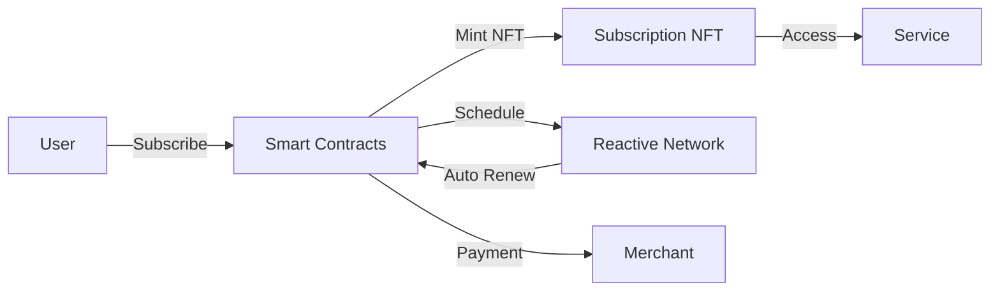

<div align="center">
  
  
  # nftSub
  
  **The Web3 Subscription Platform**
  
  Build recurring revenue streams with NFT-based subscriptions powered by Reactive Network
  
  [](https://github.com/nftSub/nftSub-contracts)
  [](https://github.com/nftSub/nftSub-sdk)
  [](https://github.com/nftSub/nftSub-frontend)
</div>


## What is nftSub?

nftSub revolutionizes subscription services on blockchain by combining NFTs with automated recurring payments. Each subscription is represented as a transferable NFT, enabling new business models and secondary markets for subscription access.

## Architecture



## Repositories

### [nftSub-contracts](https://github.com/nftSub/nftSub-contracts)
Core smart contracts implementing the subscription logic
- ERC-721 NFT subscriptions
- Automated payment processing via Reactive Network
- Multi-token payment support (ETH & ERC-20)
- Merchant management system

### [nftSub-sdk](https://github.com/nftSub/nftSub-sdk)
TypeScript SDK for seamless integration
- React hooks for subscription management
- Pre-built UI components
- Comprehensive TypeScript support
- Event monitoring and analytics

### [nftSub-frontend](https://github.com/nftSub/nftSub-frontend)
Documentation and demo application
- Interactive demos
- Integration guides
- API documentation
- Component playground

## Key Features

- **NFT-Based Subscriptions**: Each subscription is a tradeable NFT
- **Automated Renewals**: Reactive Network handles recurring payments
- **Multi-Token Support**: Accept ETH and any ERC-20 token
- **Analytics Dashboard**: Track subscription metrics and revenue
- **Secure & Decentralized**: Built on Ethereum with best practices
- **Easy Integration**: Full SDK with React hooks and components

## Quick Start

```bash
# Install the SDK
npm install @nft-sub/sdk

# or with pnpm
pnpm add @nft-sub/sdk
```

```typescript
import { SubscriptionSDK } from '@nft-sub/sdk';

const sdk = new SubscriptionSDK({
  chain: 'sepolia',
  walletClient: walletClient
});

// Subscribe to a merchant
const txHash = await sdk.subscribe(1n, 'ETH');
// or with ERC-20 token
const txHash = await sdk.subscribe(1n, '0x...');
```

## Live Deployments

### Sepolia Testnet
- SubscriptionNFT: `0x404cb817FA393D3689D1405DB0B76a20eDE72d43`
- SubscriptionManager: `0x82b069578ae3dA9ea740D24934334208b83E530E`
- SubscriptionReactive: `0xa55B7A74D05b5D5C48E431e44Fea83a1047A7582`

## Use Cases

- **SaaS Platforms**: Subscription-based software services
- **Content Creators**: Exclusive content access
- **Gaming**: Battle passes and premium features
- **DeFi Protocols**: Premium analytics and tools
- **DAOs**: Membership and governance access
- **NFT Collections**: Recurring utility access

## Contributing

We welcome contributions! Check out our repositories for:
- Smart contract improvements
- SDK enhancements
- Documentation updates
- Bug fixes and features

## Documentation

Visit our [documentation site](https://github.com/nftSub/nftSub-frontend) for:
- Getting started guides
- API references
- Integration examples
- Best practices

## Links

- [Website](https://nftsub.io) *(coming soon)*
- [Twitter](https://twitter.com/nftsub)
- [Discord](https://discord.gg/nftsub)

## License

All nftSub projects are MIT licensed.

---

<div align="center">
  Built for the Web3 community
</div>